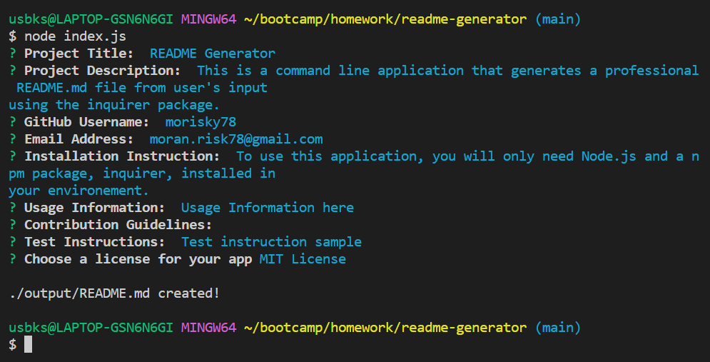

# README Generator

## Description
This is a command line application that generates a professional README.md file from user's input using the inquirer package.

## Installation
To use this application, you will only need Node.js and a npm package, inquirer, installed 

On your desired folder to locate the app, pull down the Repo into your computer by following line on your terminal  

    $ git clone git@github.com:morisky78/readme-generator.git

Go on [official Node.js website](https://nodejs.org/) and download the installer. 

Then install the inquirer npm package dependency by following command

    $ npm install

Then, you will see node_modules folder has been created on your folder.

## Usage
When you run `node index.js`, the application will prompt you with a series of questions about your project. Project title, description, your email, and github user name are required and other questions are optional.

The application takes your responses and generate README.md file on the output folder for you.
The following video shows an example usage of the app demonstrating the functionality.

[[Watch the demonstration video]](https://watch.screencastify.com/v/Bk9iDhoUoPsBxZAI0lHS)

The following is the screenshot on the terminal and a sample README file created by this application. (`./output/README.md`)  

## License
MIT License

Copyright (c) 2022 Mo Risk

Permission is hereby granted, free of charge, to any person obtaining a copy
of this software and associated documentation files (the "Software"), to deal
in the Software without restriction, including without limitation the rights
to use, copy, modify, merge, publish, distribute, sublicense, and/or sell
copies of the Software, and to permit persons to whom the Software is
furnished to do so, subject to the following conditions:

The above copyright notice and this permission notice shall be included in all
copies or substantial portions of the Software.

THE SOFTWARE IS PROVIDED "AS IS", WITHOUT WARRANTY OF ANY KIND, EXPRESS OR
IMPLIED, INCLUDING BUT NOT LIMITED TO THE WARRANTIES OF MERCHANTABILITY,
FITNESS FOR A PARTICULAR PURPOSE AND NONINFRINGEMENT. IN NO EVENT SHALL THE
AUTHORS OR COPYRIGHT HOLDERS BE LIABLE FOR ANY CLAIM, DAMAGES OR OTHER
LIABILITY, WHETHER IN AN ACTION OF CONTRACT, TORT OR OTHERWISE, ARISING FROM,
OUT OF OR IN CONNECTION WITH THE SOFTWARE OR THE USE OR OTHER DEALINGS IN THE
SOFTWARE.

## Credits

- licence badges
https://gist.github.com/lukas-h/2a5d00690736b4c3a7ba

- Professional README Guide
https://coding-boot-camp.github.io/full-stack/github/professional-readme-guide

## Questions
If you have any questions, please contact me moran.risk78@gmail.com  
GitHub profile: [morisky78](https://github.com/morisky78/) 